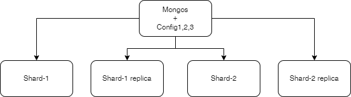

# db_assignment3_mongodb_sharding

Benjamin Curovic & Daniel Grønbjerg

Frontend available at:
http://db-ass-mongo-config.northeurope.cloudapp.azure.com/

Add from twitter will use the actual Twitter API and add a 100 tweets that has the word 'banana' in it.

List will list tweets from the database

Add will let you add a tweet to the database, but only source and text.

The database is set up across 5 azure virtual machines:

A full script to run 5 linux machines, install mongodb and set up database can be found udner cloud/native/setup.sh.
This will require Azure CLI installed and an azure subscription to run.

The servers are on the same virtual network and can therefor communicate.
Firewall restricts all outside access to port 80/443 (no ssl has been set up though).

Answers to the questions found in: Assignment 3 MongoDB.pdf